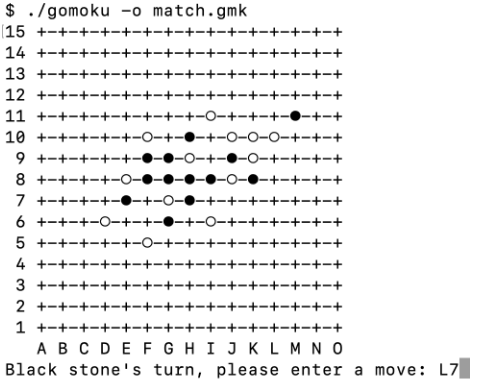

# gomoku_renju_board_game

<picture>
 <source media="(prefers-color-scheme: dark)" srcset="media/dark_mode_board.png">
 <source media="(prefers-color-scheme: light)" srcset="media/light_mode_board.png">
 
</picture>

## Rules and Info
 A clone of the Gomoku and Renju board game. Allows 2 players to play via the command line. Details about the rules of the Gomoku and Renju (a variant of Gomoku) can be found on [Wikipedia](https://en.wikipedia.org/wiki/Gomoku). Brief explanations for each game type are below. In either game type, players take turns placing different colored stones to achieve the specified victory conditions.

### Gomoku Basics
 In a nutshell, the goal for either player in Gomoku is to connect 5 same-colored stones in a row, either horizontally, vertically or diagonally, and prevent the other player from doing so. Players can also win by creating a row of 6 or more stones on the same line,
which is called an overline, there's no restriction on this in freestyle Gomoku. The line can be created vertically, horizontally, or diagonally. A few examples are provided below.

<picture>
 
</picture>

 ### Renju Basics
In freestyle Gomoku, the black stone has a big advantage as it always starts first. There are strategies for the black stone player to win no matter how good
the white stone player is. To overcome this problem, many restrictions on the black stone were invented, Renju forbidden moves are some of those. We
need to introduce a prerequisite concept in order to understand what exactly the forbidden moves are.

An open four, is four stones on the same line that you can create a five with one of two different possible moves, so it's four stones in a row with at
least one empty intersection on both ends. Your opponent can't stop you from creating a five unless you miss it or choose not to. Below are some
examples of open fours.

<picture>
 
</picture>

With this concept clear, we define the forbidden moves in Renju as: (1) a move that creates at least two open fours; (2) a move that creates at least one
overline. Furthermore, the forbidden move (1) will be allowed if it wins the match and does not create an overline.

Therefore in Renju, the black stone player can only win by creating an exact five without making any of the forbidden moves except the last move that
creates the five; the white stone player on the other hand can win by either creating a five or an overline without any restriction, or forcing the black
stone player into making a forbidden move.

## How to Install and Run:
1. Download all files provided
2. Open your preferred C compiler shell and open the "game" folder
3. Enter the "make" command and the Makefile will compile and link all files via gcc commands
4. Run either the Gomoku or Renju program with the following commands. In the following list, ./gomoku can be substituted for ./renju.

./gomoku                    -> Initiates a gomoku game with a 15x15 size board\
./gomoku -b ##              -> Initiates a gomoku game with a ##x## size board. Boards can be 15x15, 17x17 or 19x19\
./gomoku -o filename.gmk    -> Initiates a gomoku game which will save its progress as the given file when the program ends\
./gomoku -r filename.gmk    -> Resumes a saved gomoku game from its saved point\

The above commands can be used any in combination with each other with the exception of -b and -r; the board size of an existing game cannot be edited.

## Replaying Completed Games
Finished games can be replayed via their saved .gmk files. To do so, enter the following command:\
\
./replay saved-game.gmk\
\
The given game will begin cycling through each turn at a rate of 1 turn per second until it completes.

## Credit
This project was completed as part of NC State's CSC230 - C and Software Tools course. NC State provided all .txt test files and initial project design and requirements. Implementation was completed by Joe Hummer.